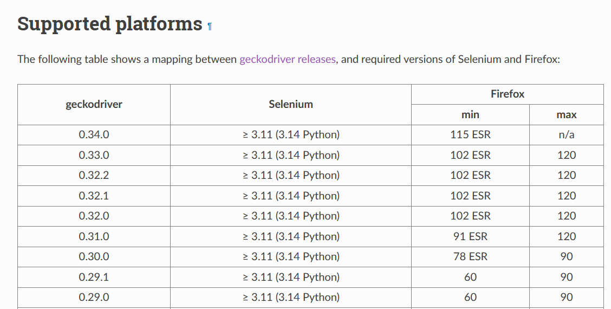
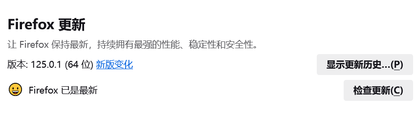

# crawling_comics

## 说明

> 漫画爬虫工具

使用selenium搭建的简单漫画爬虫工具。具体爬取逻辑针对不同网站需要手动编写具体爬取逻辑(大同小异)

参考demo.py，设置相应的参数：

```python
#-*- coding: utf-8 -*-

import cartoon_cat as cc

if __name__ == '__main__':

    site = '漫画首页url'

    crawler = cc.CartoonCat(
        site=site,                                  # 漫画首页
        begin=0,                                    # 起始章节
        end=-1,                                     # 结束章节，为负数表明不设结束章节
        save_folder='./download',           # 保存路径，不存在会自动创建
        browser=cc.BrowserType.FIREFOX,     # 浏览器类型：FIREFOX，CHROME，SAFARI，IE，PHANTOMJS
        driver='./driver/geckodriver.exe')  # 驱动程序路径                                      
    crawler.start()
```

## 浏览器类型对于驱动

**Firefox驱动各个版本下载地址：**

+  https://github.com/mozilla/geckodriver/releases

+ 对应版本查看请参考：[Supported platforms — Firefox Source Docs documentation (mozilla.org)](https://firefox-source-docs.mozilla.org/testing/geckodriver/Support.html)

  

Firefox浏览器版本：在“设置-》常规-〉Firefox更新”中可以查看版本号

Firefox全历史版本下载： http://ftp.mozilla.org/pub/mozilla.org//firefox/releases/



**Chrome驱动各个版本下载地址：**  

+ http://chromedriver.storage.googleapis.com/index.html

+ 对应版本查看请参考：

  ```
  chrome版本	chromedriver版本
  83.0.4103.39	83
  83.0.4103.14	83
  81.0.4044.138	81
  81.0.4044.69	81
  81.0.4044.20	81
  80.0.3987.106	80
  80.0.3987.16	80
  79.0.3945.36	79
  79.0.3945.16	79
  78.0.3904.105	78
  78.0.3904.70	78
  78.0.3904.11	78
  77.0.3865.40	77
  77.0.3865.10	77
  76.0.3809.126	76
  76.0.3809.68	76
  76.0.3809.25	76
  76.0.3809.12	76
  75.0.3770.90	75
  75.0.3770.8		75
  74.0.3729.6		74
  73.0.3683.68	73
  72.0.3626.69	72
  2.46			71-73
  2.45			70-72
  2.44			69-71
  2.43			69-71
  2.42			68-70
  2.41			67-69
  2.4 			66-68
  2.39			66-68
  2.38			65-67
  2.37			64-66
  2.36			63-65
  2.35			62-64
  ```

## 版本需求

详情见:  environment.yml 或者 requirements.txt

```
# This file may be used to create an environment using:
# $ conda create --name <env> --file <this file>
# platform: win-64
brotlipy=0.7.0=py38h2bbff1b_1003
bzip2=1.0.8=h2bbff1b_5
ca-certificates=2024.3.11=haa95532_0
certifi=2024.2.2=py38haa95532_0
cffi=1.16.0=py38h2bbff1b_0
cryptography=41.0.3=py38h3438e0d_
selenium=3.141.0=py38h2bbff1b_1000
.......
```

## 常用方法

例子

```python
# 使用 CSS 选择器定位所有 class="pic" 或 class="pic loading" 的元素
pic_elements = driver.find_elements_by_css_selector(".pic, .pic.loading")
# 获取其 _src 属性值
for element in pic_elements:
    src_attribute = element.get_attribute("_src")
    if src_attribute:
        print(src_attribute)
```

例子

```python
from selenium import webdriver
from selenium.webdriver.common.keys import Keys
from selenium.webdriver.firefox.options import FirefoxOptions
import time
import random

# 设置 Firefox 无头模式选项
firefox_options = FirefoxOptions()
firefox_options.headless = True

# 设置随机 User-Agent 列表
user_agents = [
    "Mozilla/5.0 (Windows NT 10.0; Win64; x64) AppleWebKit/537.36 (KHTML, like Gecko) Chrome/91.0.4472.124 Safari/537.36",
    "Mozilla/5.0 (Windows NT 10.0; Win64; x64) AppleWebKit/537.36 (KHTML, like Gecko) Chrome/91.0.4472.124 Safari/537.36 Edg/91.0.864.59",
    "Mozilla/5.0 (Macintosh; Intel Mac OS X 10_15_7) AppleWebKit/537.36 (KHTML, like Gecko) Chrome/91.0.4472.124 Safari/537.36",
    "Mozilla/5.0 (Macintosh; Intel Mac OS X 10_15_7) AppleWebKit/537.36 (KHTML, like Gecko) Chrome/91.0.4472.124 Safari/537.36 Edg/91.0.864.59",
    # 添加更多的 User-Agent
]

# 随机选择一个 User-Agent
user_agent = random.choice(user_agents)

# 设置代理服务器（可选）
# proxy = "IP:Port"
# proxy_options = {
#     'proxy': {
#         'http': proxy,
#         'https': proxy,
#         'ftp': proxy,
#         'socks': proxy
#     }
# }

# 实例化 WebDriver，并设置相关选项
# driver = webdriver.Firefox(options=firefox_options, executable_path=driver_path, seleniumwire_options=proxy_options)
driver = webdriver.Firefox(options=firefox_options, executable_path="geckodriver.exe")

# 设置随机等待时间
def random_sleep():
    time.sleep(random.uniform(1, 3))

# 访问网站
url = "https://example.com"
driver.get(url)
random_sleep()

# 模拟人类行为，如滚动页面、点击等
driver.execute_script("window.scrollTo(0, document.body.scrollHeight);")
random_sleep()

# 点击按钮或链接
button = driver.find_element_by_xpath("//button[@id='example-button']")
button.click()
random_sleep()

# 关闭浏览器
driver.quit()
```

## 参考

个人爬虫笔记:  [python-note (github.com)](https://github.com/Auroraol/python-note/blob/main/爬虫/Python爬虫/Python爬虫.md)

